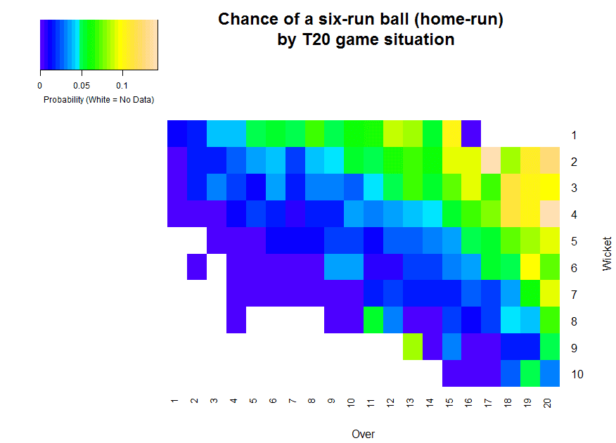

Final project: Twenty20 cricket data.

- Goals/Evaluation of the project
- What is cricket?
- The dataset
- Duckworth-Lewis, and the concept of resources


# Goals/Evaluation of the project

First, the goals and evaluation, followed by lots of context to make this clearer, I hope.

Use the ball-by-ball dataset to do the following.


**Make summary statistics (25 of 100 points)** Find two other ways to split the data and present it like in the above description of the relative frequencies of fours/sixes/wickets across overs and wickets lost. Each of your two slicings should involve a combination of at least three variables. Possible variables include, but are not limited to players, leagues, teams, overs left, wickets lost, runs scored so far, inning, outcome of previous ball, fielder involved, and sentiment of commentary text. Each of the two ways must include an informative ggplot.

**Identify second inning 'turning points' (25 of 100 points)** Use the runs and resources information in the next section of this document, as well as sentiment analysis of the commentary in the `FullNotes` variable to produce a list of 20 balls that could be in a highlight reel. You might do this by making up a formula that gives each ball an excitement score based on a sum of emotional valence and the amount that a team either falls behind or comes up ahead. For full marks, add some diversity to your highlight reel, it shouldn't include all sixes or all wickets. Keep this to second inning balls so that you can take advantage of the target (described next section)

**Find a meaningful clustering of matches (25 of 100 points)** Aggregate the matches (hint: the `ddply` function in the K-means clustering section is great for this) and apply K-means clustering to the matches to find some meaningful archetypes of games. Example clusters: high scoring games, very close games, games with early wickets, etc.  Make sure to scale your variables appropriately.

**Optimize Duckworth-Lewis (25 of 100 points)** Use the `optim` function on the first inning data to fit a smooth function (e.g., a polynomial or a sigmoid) to the proportion of a team's total score (run total at the end of the first inning) that they achieve after $X$ overs and $Y$ wickets lost. The Duckworth-Lewis, or DLS table essentially does a similar optimiziation, so compare your answers. (i.e., the spot where 50\% of the resource is used up is where half of the runs should be scored by.)

(The reason we don't use the second inning data is because teams might change their strategy based on their target, wheras the goal of the first inning team is basically to maximize their expected number of runs.)


# What is cricket, what is the data like?

First, what is cricket? In one sentence, it's a version of baseball, played in different (more) parts of the world, and using older rules. If you want to get a little acquainted first, here are some resources, otherwise just read along and come back to these later.


Some very good 5-10 minute explainer videos can be found at https://www.youtube.com/watch?v=AqtpNkMvj5Y ("The Rules of Cricket - EXPLAINED!" by Ninh Ly.) and https://www.youtube.com/watch?v=EfhTPGSy1aM ("The rules and gameplay of cricket, a breakdown" by Jomboy Media).

Also, a translation guide from baseball to cricket can be found at: https://www.stats-et-al.com/2018/08/baseball-cricket-translation-guide.html


Today we will focus on the Twenty20 format of Cricket, in which matches are designed to last only three hours, roughly the same time as matches in other popular team sports. This format has only been played professionally since about 2005, and it growing quickly in terms of spectator and commercial interest. The intricacies of this format are also poorly understood, which provides many good research opportunities.

In the Twenty20 format, each team is allowed one innings to score runs. (Yes, 'innings', not 'inning') That inning is over if either...

1) 10 of the 11 players are dismissed (a dismissal is also called an 'out' or a 'wicket'), or
2) 120 'fair' balls are thrown. A group of 6 throws is called an 'over', making 20 overs per innings. Hence the name Twenty20.

A small number (typically fewer than 10) of throws per innings do not count against the limit of 120 because they were not thrown in a prescribed manner. A small number of throws also incur a one-run penalty that is added to the These cases are similar to 'balls' and 'hits-by-pitch' in baseball, respectively.

Each of these 120+ throws has a discrete result that we simplified into six categories: Wicket, 0 Runs, 1 Run, 2-3 Runs, 4-5 Runs (Ground Rule Double), and 6 Runs (Home Run).  Cases where 3 runs and 5 runs occurred were rare, so we treated them as a fixed proportion of 2-3 runs (~6.4%) and 4-5 (~1.5%) runs respectively. Likewise, throws not counting against the 120 limit, and those resulting in a penalty run, were treated as a fixed proportion of each of the six categories.

Here is table of a team's batting and bowling summaries of a recent T20I match from ESPN CricInfo ( https://www.espncricinfo.com/ ).


This is a boxscore, you can find it on ESPN CricInfo and searching for `Pakistan Sri Lanka 2015 T20I` and clicking on the link labelled: `Sri Lanka v Pakistan at R Premadasa Stadium, Colombo, Jul 30, 2015` at https://www.espncricinfo.com/series/pakistan-tour-of-sri-lanka-2015-860091/sri-lanka-vs-pakistan-1st-t20i-860279/full-scorecard

This boxscore it gives a record of what each player did in the game and some summary stats the players' performances, but not much of the context.

For example, we know that Muhktar Ahmed the first batter/batsman, and that he...

- scored 2 runs (R), 
- faced 8 balls (B), 
- was bowled to for 10 minutes (M), 
- scored no 4s or 6s (4 and 6 runs in a single ball from hitting the ball out of bounds with and without hitting the ground first, respectively), and 
- got a strike rate (SR) of 25.00, which is calcuated from `100*R/B`.


All of these metrics, such as 'Strike Rate', are based solely on the number of events (e.g. balls faced,  times dismissed, runs scored), without respect to when they happened. The inherit weakness of all these metrics is that they treat each throw as an identical event, independent of the number of wickets and throws remaining. For the baseball crowd, consider the difference between overall batting average, and the batting average with runners in scoring position.

Reality is more complex. Consider this: 




 This is a heat map of the empirical chance of any throw/ball/pitch ending as a six (a home run in baseball terms) as a function of overs and wickets taken. All games start in the upper-left corner, with 20 overs and 10 wickets remaining. From there, plausible game situations 'fan out', where games with situations following the top of the fan are those where relatively few batters are dismissed by the time most of the overs are used.

In these games, many sixes occur in the late game. Scoring a six involves hitting the ball with great power, which involves taking a greater risk of a dismissal. Since in these low-dismissal games, remaining throws are a more precious resource than remaining wickets, this high-risk, high-reward strategy is rational.

Here's the raw probability of scoring a four, which is similar to a ground rule double in baseball. This is a ball that touches the ground in bounds, but bounces or rolls out of bounds. As such, the fielders have an effect on the outcome that they cannot usually have on sixes. Notice that the general pattern of fours are similar to those of the sixes, except for the major drop at between the 6th and 7th overs. From the 7th over onwards, the players in the field are more restricted, and so more balls are able to roll out of bounds to score 4 runs.


 Likewise, the batting team gets really desperate in the last few overs, so they try reckless moves that frequently end in a wicket (a dismissal of a batting player). We also see wickets getting more likely when there are very few batters left. This seems counter to the intuitive strategy - that running out of batters would cause the remaining batters to be more cautious. Instead, you're seeing the effect of putting the worst batters on a team last in the batting order - they just get dismissed more often.


All of this is to say: Context matters. Wickets, sixes, and fours are all more common at the end of the game and just looking at something like the raw proportion of times that each player gets each event is misleading. What we need is something with a little more data.

# The Dataset

Well, here it is. This dataset is a detailed ball-by-ball account of about 800 Twenty20 International (T20I) and Indian Premier League (IPL) matches. IPL also uses the Twenty20 format and uses many (not all) of the same players. Matches happened roughly 2008-2014.

There is a lot to look at here. The situation, batter, bowler, relevant fielder, and text description are all listed for each of 150-250 balls in each match. Several research papers have been written using this dataset, and there's still several more that could be written before it's exhausted.

```{r}
gamelog = read.csv("Gamelog T20I Stat 847.csv")
```

```{r}
dim(gamelog)
length(unique(gamelog$MatchNo))

head(gamelog, n=3)
```

This dataset was generated with a LOT of data cleaning from the text commentary, also available on CricInfo

https://www.espncricinfo.com/series/pakistan-tour-of-sri-lanka-2015-860091/sri-lanka-vs-pakistan-1st-t20i-860279/ball-by-ball-commentary


The data dictionary below skips over a couple irrelvant / redundant variables.


| Variable    | Format      | Description                                                       |
|-------------|-------------|-------------------------------------------------------------------|
| Format      | Categorical | League format - either T20 International or Indian Premier League |
| MatchNo     | Numeric     | Match ID, 1-500 for T20I or YYYY01 - YYYY99 for IPL               |
| TeamBatting | Character   | 2-3 letter code for the team bowling this inning                  |
| TeamBowling | Character   | 2-3 letter code for the team batting this inning                  |
| Inning      | Numeric     | Half of the game, teams switch between innings.                   |
| Over        | Numeric     | Group of six balls. 0-19.                                         |
| Ball        | Numeric     | Ball of the over. Note that over-ball is not always unique.       |
| Bowler      | Character   | Name of the bowler                                                |
| BowlerID    | Numeric     | Unique ID for this bowler, consistent across variables            |
| Batsman     | Character   | Name of the batter / batsman                                      |
| BatsmanID   | Numeric     | Unique ID for this batsman                                        |
| Fielder     | Character   | Name of the fielder mentioned in the summary, if any              |
| FielderID   | Numeric     | Unique ID for the mentioned fielder                               |
| NumOutcome  | Numeric     | Code for outcome: 0-7 is number of runs, -1 is wicket             |
| BallType    | Categorical | Type of even. Anything but run or out is usually a re-ball        |
| NumBallType | Numeric     | Code for Ball Type                                                |
| FullNotes   | Character   | Text transcript of announcer describing the event                 |
| Wickets     | Numeric     | Number of wickets/outs at the beginning of the ball               |


# Duckworth-Lewis and Resources


This is the standard (public) version of the Duckworth-Lewis-Stern table.

```{r}
DLS = read.csv("DLS_T20.csv")[,-1]
DLS # jth row, kth column is jth over, kth wicket
```


It was originally designed to determine winners of matches that are interrupted and cancelled in the second inning because of weather. As we saw in a previous section, game context matters so it's not a simple runs-per-over calculation. The standard table is for the one-day format of the game, which takes about 8 hours to play. Twenty20 games are much less likely to be cancelled due to rain, but the table is still useful, **but make sure to only use the part of the table with 20 or fewer overs remaining**.

The values in each cell from 0 to 1 are the resources. This measures the proportion of a team's runs they are expected to still get based on the number of overs and wickets remaining. A team with 50 overs remaining and 0 wickets lost has just begun their batting inning, and so they have 100\% of their resources remaining. With every over that passes, and every time a batter gets out (loses a wicket), the proportion of the batting team's resources remaining descreases. The decrease is non-linear: losing your first wicket with only 1 over left is pretty much irrelevant, so there is loss than 0.1\% loss of resource for that, but losing your first wicket early matters substantially more, so there is a loss of about 3\% if your resource for that.

In the second inning, the batting team knows how many runs their opponent scored, so they know their **target**, which is the number of runs needed to win the game. The team batting second knows if they are falling behind or getting ahead comparing their progress to the target to their resources remaining.

For example:

If the first batting team scores 199 runs (high, but not unheard of), then the second batting team has a target of 200 runs (199 + 1), and 100*\% of their resources to reach the target. (1 in the table: 20 overs left, 0 wickets lost). They need 2 runs per percentage of resource.

```{r}
DLS[1,1]
```

At the start of the 11th over, the batting team has had 3 outs/wickets lost and score 75 runs. Are they winning?

```{r}
DLS[11,4]
```


They have 52.7\% of their resources remaining (or 47.3\% used), so they need to have scored 47.3\% of the target, or 94-95 runs, in order to keep on track to just barely win the game. In short, they are losing.

You can linearly interpolate to determine the resources remaining after each ball, which is useful if you want to determine if an event was good for the batting team or the bowling team by seeing if an event produced more or less runs per resource than the target, respectively.

For example, at 10.0 with 3 wickets lost, 52.7\% resources remain. After another ball is thrown, 1/6 of an over is used, so the resources left are now 51.6\%, they have used 0.9\% of the total.

```{r}
resource_left = 5/6*DLS[11,4] + 1/6*DLS[12,4]
resource_used = DLS[11,4] - resource_left
round(resource_left, 3) # round to 3 digits
round(resource_used, 3) # round to 3 digits
```

Going from the target set at the start of the inning, the batting team needed 2 runs per 1\% of resource, so if they scored more than 1.8 runs on this ball, they caught up some, but if they score 0 or 1 runs they fell farther behind.

What would be even worse for the batting team is if they lost a wicket on that ball. In that case, by interpolating overs in the 4-wickets-lost column, we see that they would have 49.2\% of their resources left, having lost 3.3\% of the total.

```{r}
resource_left = 5/6*DLS[11,5] + 1/6*DLS[12,5]
resource_used = DLS[11,4] - resource_left
round(resource_left, 3) # round to 3 digits
round(resource_used, 3) # round to 3 digits

target = 200
runs_needed_to_keep_up = round(resource_used * target, 3)
runs_needed_to_keep_up
```

To keep up with the target, the batting team needs to score 6.7 runs for every 3.3\% of the resources used. The most runs you can normally score in a single ball is 6, so there's no way to come out ahead with you lose a wicket. (Also, since getting out usually means a failure of the batting team, getting a 6 AND losing a wicket at the same time would be bizzare.)

This sort of comparison between runs and resources is going to be useful in determining game highlights.